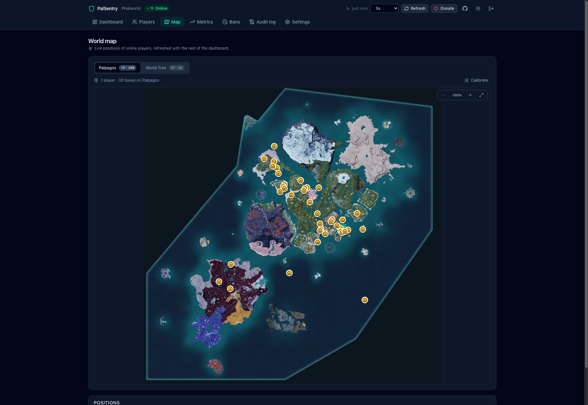
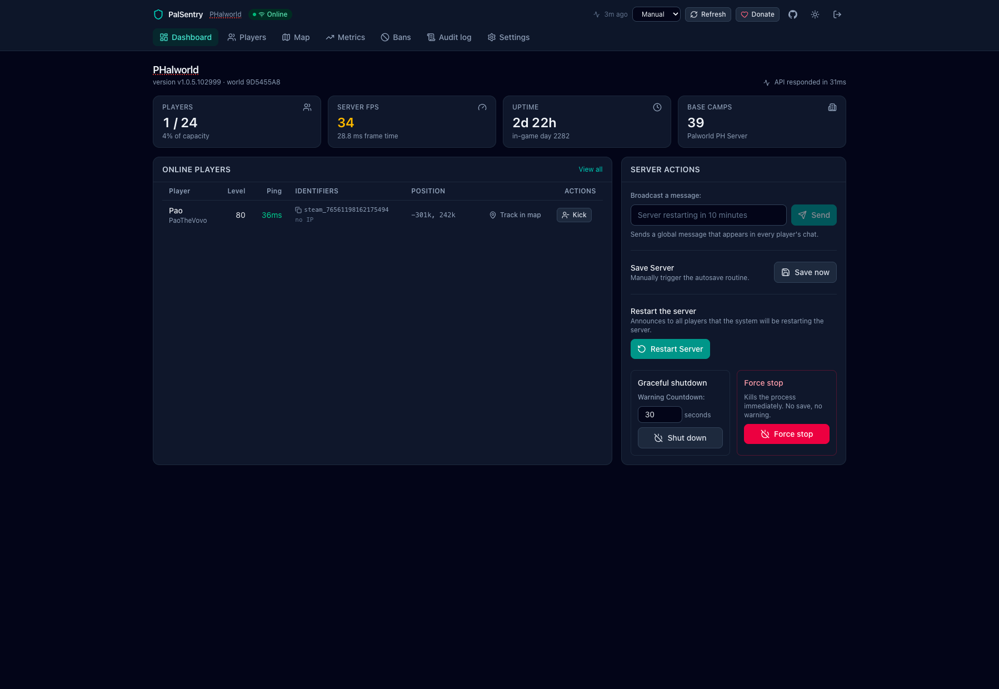
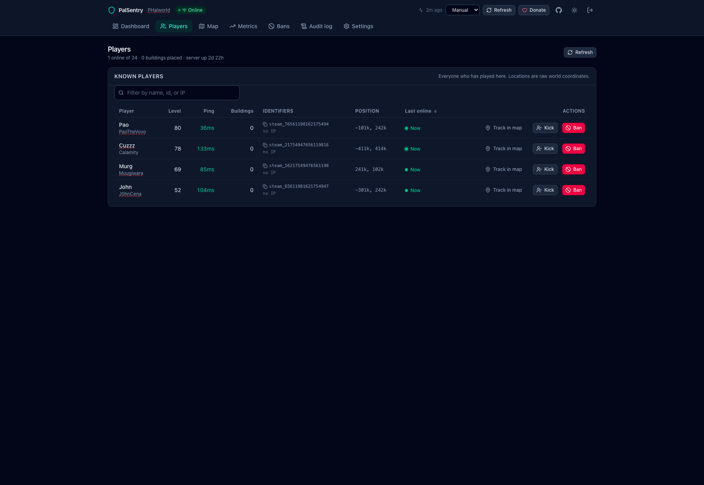
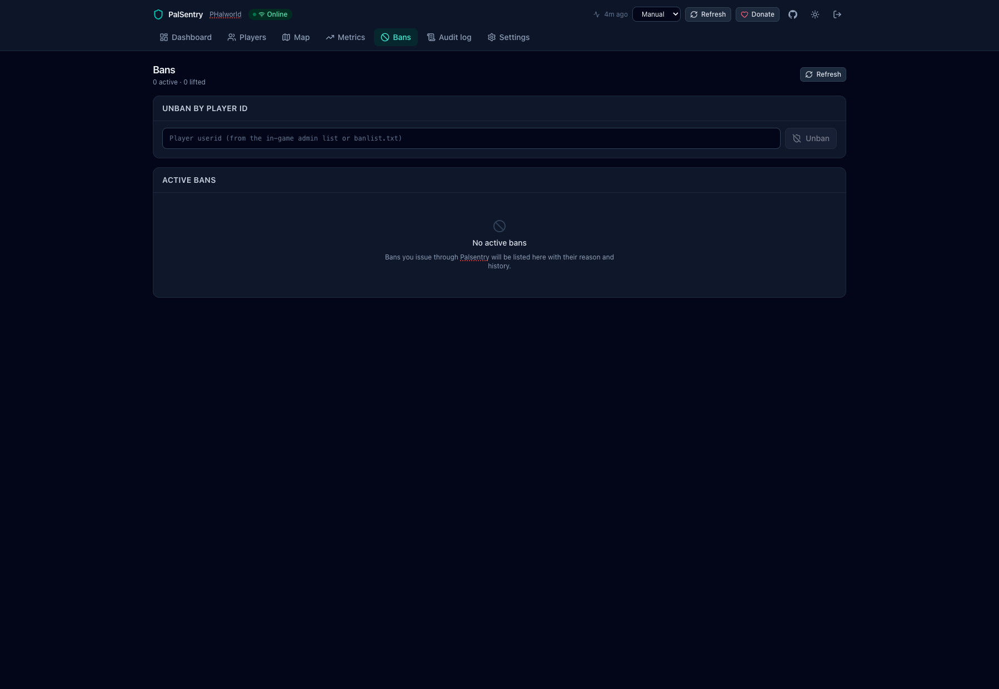
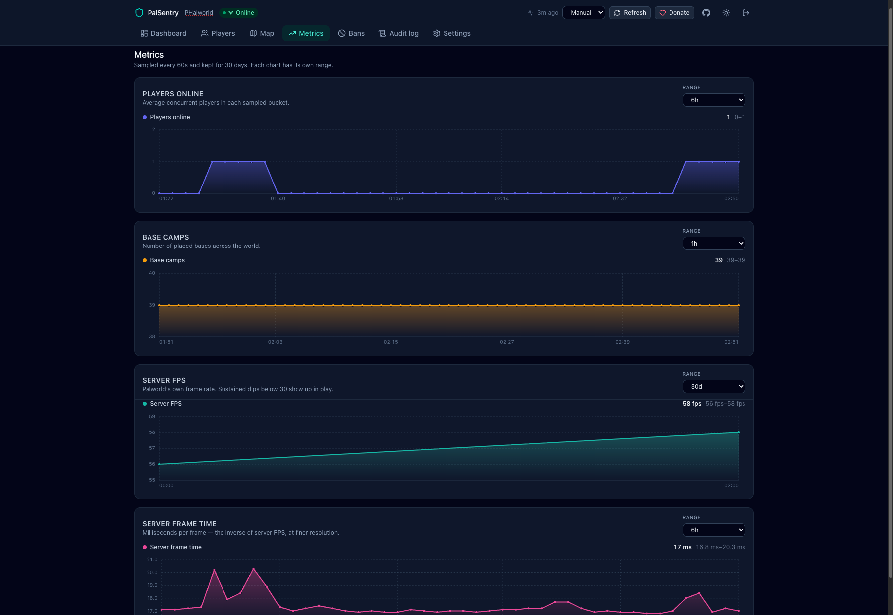

# PalSentry

**PalSentry** is a modern monitoring and management dashboard for your [Palworld](https://www.palworldgame.com/) dedicated server.

Monitor players, track activity on a live world map, manage your server, review historical performance metrics, and perform common administrative tasks — all from a single web interface.

[](https://hub.docker.com/r/wisdomsky/palsentry)
[](https://hub.docker.com/r/wisdomsky/palsentry)
[](https://github.com/WisdomSky/PalSentry/actions)
[](https://github.com/WisdomSky/PalSentry/blob/main/LICENSE)

---

## Installation

### Docker Run

```sh
docker run -d -p 3000:3000 -e PALWORLD_REST_URL="http://192.168.1.50:8212" -e PALWORLD_ADMIN_PASSWORD="your Palworld AdminPassword" wisdomsky/palsentry:latest
```

### Docker Compose

```yaml
services:
  palsentry:
    image: wisdomsky/palsentry:latest
    restart: unless-stopped
    ports:
      - '3000:3000'
    environment:
      PALWORLD_REST_URL: 'http://192.168.1.50:8212'
      PALWORLD_ADMIN_PASSWORD: 'your Palworld AdminPassword'
```

> [!CAUTION]
> Before starting, make sure the Palworld REST API and `-enable-gamedata-api` is enabled.

Once running, PalSentry can now be accessed from the browser:

```text
http://localhost:3000
```

---

## Features

### Live World Map

The live world map displays all of your bases and their locations. It also shows all currently online players and their positions in real time.



The map also includes a special **Tracking Mode**, allowing you to focus on a specific player and automatically follow their movements in real time.

The map keeps the selected player in view even when they travel long distances or teleport to another location.


### Enhanced Server Tools

PalSentry does more than display server information — it also provides convenient administrative controls directly from the dashboard.

Perform common server operations such as:

- Broadcasting announcements
- Restarting the server
- Shutting down the server
- Kicking players
- Banning and unbanning players



### Player Management

The dashboard provides a quick overview of currently online players, while the dedicated **Players** page gives you access to both online and offline player records.

You can view additional information such as when a player was last online and manage players even when they are no longer connected to the server.

You can even permanently ban offline players — no need to wait for them to reconnect before taking action.





### Enhanced Server Metrics

PalSentry continuously collects server statistics and stores them for historical analysis.

By default, server metrics are collected every minute and displayed in clean, easy-to-read graphs, allowing you to monitor trends and better understand your server's performance over time.



---

## Environment Variables

| Variable                                   | Default      | Description                                                                      |
| ------------------------------------------ | ------------ | -------------------------------------------------------------------------------- |
| `PALWORLD_REST_URL`                        | **Required** | Palworld REST API host and port                                                  |
| `PALWORLD_ADMIN_PASSWORD`                  | **Required** | Palworld `AdminPassword`                                                         |
| `PALSENTRY_SESSION_SECRET`                 | ``           | Cookie-signing secret; must be at least 32 characters                            |
| `PALSENTRY_LOGIN_USERNAME`                 | `admin`      | PalSentry dashboard login username                                               |
| `PALSENTRY_LOGIN_PASSWORD`                 | `admin`      | Plaintext dashboard password                                                     |
| `PALSERVER_REST_USERNAME`                  | `admin`      | HTTP Basic Authentication username used by the Palworld REST API                 |
| `PALSENTRY_LOGIN_PASSWORD_HASH`            |              | Generated scrypt password hash; takes precedence over `PALSENTRY_LOGIN_PASSWORD` |
| `PALSENTRY_SESSION_TTL_HOURS`              | `12`         | Dashboard session lifetime in hours                                              |
| `PALSERVER_TIMEOUT_MS`                     | `10000`      | Palworld REST API request timeout in milliseconds                                |
| `PALSENTRY_ALLOW_DESTRUCTIVE`              | `true`       | Enables kick, ban, unban, shutdown, stop, and restart operations                 |
| `PALSENTRY_TRUST_PROXY`                    | `false`      | Trust proxy IP headers and use Secure cookies                                    |
| `PALSENTRY_SAMPLE_INTERVAL_SECONDS`        | `60`         | Metrics and player-roster sampling interval (`5`–`3600`)                         |
| `PALSENTRY_HISTORY_RETENTION_DAYS`         | `30`         | Number of days historical metrics are retained (`1`–`3650`)                      |
| `PALSENTRY_RESTART_WAIT_SECONDS`           | `30`         | Default player-warning countdown before a restart                                |
| `PALSENTRY_RESTART_HEALTH_TIMEOUT_SECONDS` | `180`        | Maximum time to wait for the server to become healthy after a restart            |
| `PALSENTRY_RESTART_POLL_INTERVAL_MS`       | `2000`       | Health-check interval while waiting for the server to return                     |
| `PALSENTRY_MAP_PROJECTION`                 | `new`        | Map projection mode: `none`, `new` for Palworld 1.0+, or `legacy`                |
| `LOG_LEVEL`                                | `info`       | Logging level: `fatal`, `error`, `warn`, `info`, `debug`, `trace`, or `silent`   |

Without overrides, the dashboard login is `admin` / `admin`, the session secret uses the documented shared default, and destructive actions are enabled. These defaults are convenient on a trusted local network; before exposing PalSentry, add safer overrides under `environment`.

```yaml
PALSENTRY_LOGIN_PASSWORD: 'some-cute-username'
PALSENTRY_LOGIN_PASSWORD: 'a-password-stronger-than-love'
PALSENTRY_SESSION_SECRET: 'replace-with-a-random-secret-at-least-32-characters-long'
PALSENTRY_ALLOW_DESTRUCTIVE: 'false'
```

> To generate a unique `PALSENTRY_SESSION_SECRET` string, run the command `openssl rand -hex 32` in the terminal.

## Persistent Data

PalSentry stores its persistent application data under:

```text
/data
```

```yaml
services:
  palsentry:
    image: wisdomsky/palsentry:latest
    restart: unless-stopped
    ports:
      - '3000:3000'
    environment:
      PALWORLD_REST_URL: 'http://192.168.1.50:8212'
      PALWORLD_ADMIN_PASSWORD: 'your Palworld AdminPassword'
    volumes:
      - ./data:/data
```

This allows historical metrics, player information, and other persistent data to survive container upgrades and recreation.

## Security

PalSentry exposes administrative functionality for your Palworld server, so it should be treated as a privileged service.

For production deployments:

- Replace the default `admin` dashboard password with a strong password.
- Replace the shared default `PALSENTRY_SESSION_SECRET` with a randomly generated value.
- Set `PALSENTRY_ALLOW_DESTRUCTIVE=false` unless destructive operations are required.
- Avoid exposing PalSentry directly to the public internet.
- Prefer access through a trusted LAN, VPN, or authenticated reverse proxy.
- Use HTTPS when exposing the dashboard through a reverse proxy.

## Updating

### Docker Compose

Pull the latest image and recreate the container:

```sh
docker compose pull
docker compose up -d
```

Pull the latest image:

```sh
docker pull wisdomsky/palsentry:latest
```

Then recreate your container using the same `/data` volume. If you overrode `PALSENTRY_SESSION_SECRET`, reuse the same value to keep existing sessions valid.
